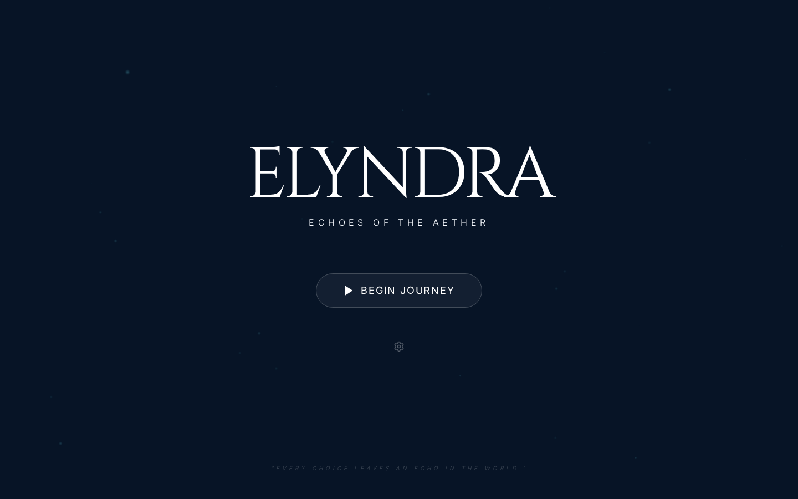
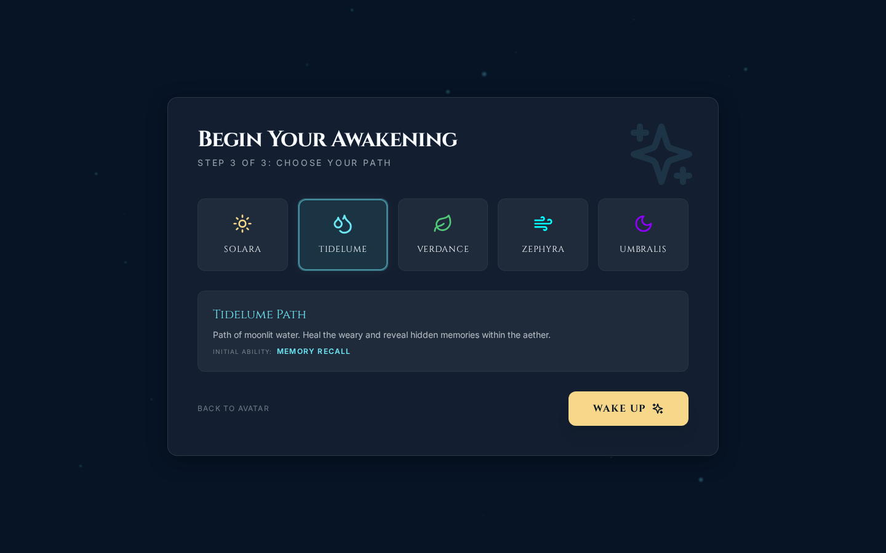
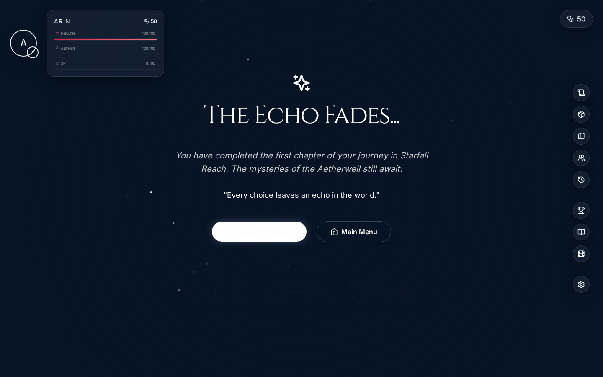
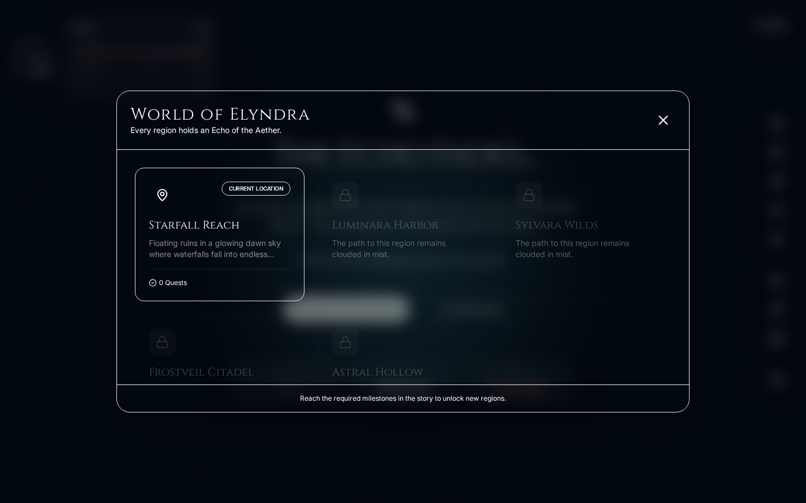
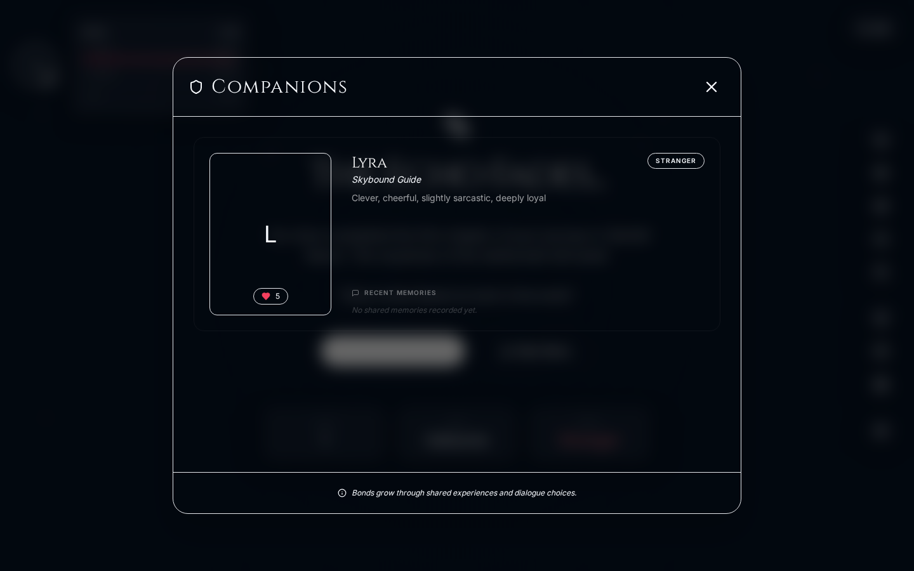

# ELYNDRA: Echoes of the Aether

“Every choice leaves an echo in the world.”

**ELYNDRA: Echoes of the Aether** is a premium, visually breathtaking, playable web-based AI fantasy RPG. Inspired by the cinematic wonder of anime-fantasy open worlds, it features dynamic AI-powered storytelling, a deep original magic system, and a persistent memory-based NPC interaction engine.

---

## ✨ Features

- **Cinematic Experience:** Luminous skies, drifting magical particles, and elegant glassmorphism UI.
- **Dynamic AI DM:** A backend AI architect (Express + AI Provider) that generates meaningful consequences based on your path and decisions.
- **NPC Memory System:** Characters like Lyra remember your choices, influencing future dialogue and affinity.
- **Voice Narration:** Fully integrated browser-based TTS for every NPC line with unique voice styles.
- **Original Magic System:** Choose from five Aether Paths (Solara, Tidelume, Verdance, Zephyra, Umbralis) that change your journey.
- **Rich RPG Systems:** Inventory management, world map exploration, companion bonds, achievements, and lore codex.
- **Multi-Ending:** Multiple branching endings (Guardian, Wandering Star, Crown of Echoes) shaped by player decisions.
- **Persistent State:** Saves your progress locally, ensuring your journey continues where you left off.
- **Demo Mode:** Fully functional without any AI API keys using structured fallback logic.

---

## 🖼️ Gallery







---

## 🛠️ Tech Stack

- **Frontend:** React, Vite, Tailwind CSS, Framer Motion (Animations), Lucide React (Icons), Zustand (State Management).
- **Backend:** Node.js, Express, dotenv, Axios, CORS, Helmet.
- **AI Integration:** Secure adapter architecture supporting OpenAI, Gemini, and Anthropic Claude.
- **Testing:** Playwright (E2E User Journey Verification).

---

## 🚀 Installation & Setup (Windows PowerShell)

### Prerequisites
- Node.js (v18 or higher)
- npm

### 1. Setup the Backend
```powershell
cd elyndra-echoes-of-the-aether/server
npm install
cp .env.example .env
# Edit .env and add your AI_API_KEY if you want real AI generation
npm start
```

### 2. Setup the Frontend
```powershell
cd elyndra-echoes-of-the-aether/client
npm install
npm run dev
```

---

## 🎮 How to Play

1. **Title Screen:** Begin your journey or continue a saved echo.
2. **Character Creation:** Choose your name and one of the five **Aether Paths**.
3. **Adventure:** Interact with NPCs using the dialogue panel. Your choices affect the world.
4. **Systems:**
   - Use the **Right Sidebar** to access your **Quest Journal**, **Inventory**, **World Map**, **Companions**, and **Memory Timeline**.
   - Watch for the **Adventure Rewards** popups after major choices.
   - Toggle **Voice Narration** to hear the world of Elyndra come to life.

---

## 🗺️ World of Elyndra

1. **Starfall Reach:** Floating ruins in a glowing dawn sky (Prologue).
2. **Luminara Harbor:** Coastal city with turquoise canals.
3. **Sylvara Wilds:** Enchanted bioluminescent forest.
4. **Frostveil Citadel:** Snowy mountain kingdom.
5. **Astral Hollow:** The final mystery beyond the clouds.

---

## 🔧 AI Provider Setup

By default, the game runs in **DEMO MODE**. To enable real AI storytelling:
1. Open `server/.env`.
2. Change `AI_PROVIDER` to `openai`, `gemini`, or `anthropic`.
3. Add your corresponding `API_KEY`.
4. Restart the server.

---

## 📜 Folder Structure

```
elyndra-echoes-of-the-aether/
├── client/              # React Frontend
│   ├── src/
│   │   ├── components/  # Cinematic UI Components
│   │   ├── data/        # Game Metadata (Regions, Items, etc)
│   │   ├── hooks/       # Voice & Logic Hooks
│   │   ├── store/       # Zustand Game State
│   │   └── services/    # API Integration
├── server/              # Node.js Backend
│   ├── prompts/         # AI System Prompts
│   ├── routes/          # Story Generation Routes
│   ├── services/        # AI Provider Adapters & Demo Mode
│   └── server.js        # Express Entry Point
├── screenshots/         # Verified Game Screenshots
└── README.md            # Documentation
```

---

## 📜 Portfolio Value
This project demonstrates senior-level full-stack capabilities:
- **Complex State Management:** Orchestrating a persistent, branching RPG state.
- **Advanced UI/UX:** Implementing a high-end "Game UI" aesthetic with React and Framer Motion.
- **System Architecture:** Building a secure, multi-provider AI adapter layer.
- **QA & Verification:** Implementing stable E2E tests for visual and logical flows.

---

Developed with ✨ by the Elyndra Team.
